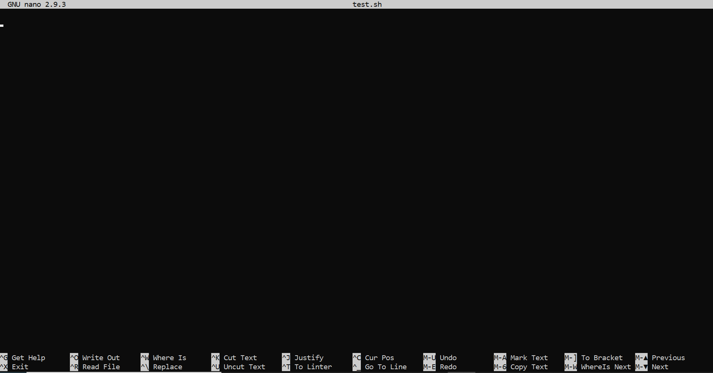
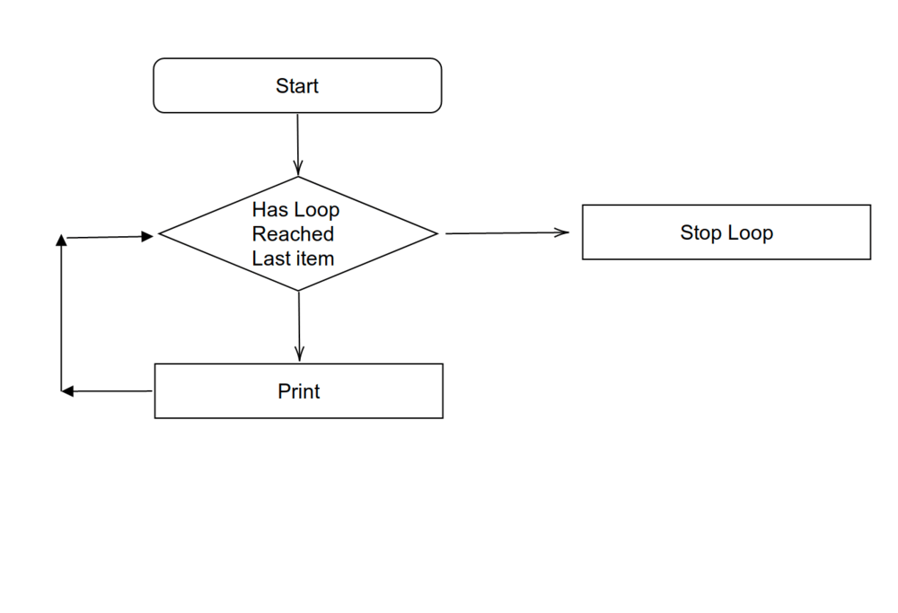
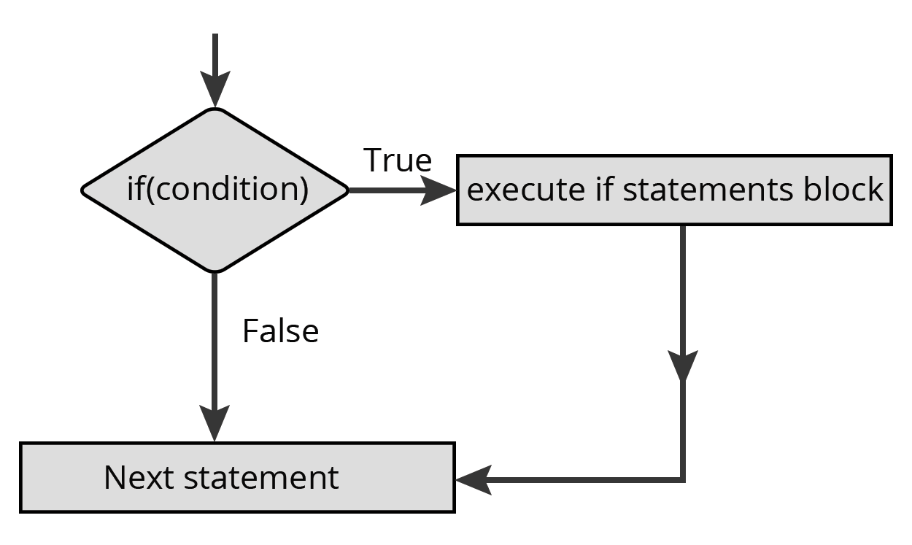

# AdvancedUnixTutorial
### Rob Schmidt
Tutorial for workshop given on 3/20/21

This is the second in a series of tutorials for the Bioinformatics and Computational Biology workshop series on Unix. In this tutorial we will cover some more advanced Unix topics. 


```
ssh <netID>@hpc-class.its.iastate.edu
```
# Installation
< add installation of putty and winscp instructions >
# Let's get started: Why do we even want to learn about Unix?
Linux/Unix has become the standard operating system for high performance computing clusters (HPCs) all around the globe. If you want the power of an HPC you need to learn the fundamentals of Unix. Plus almost all of the most popular bioinformatics tools are used on the commandline. Trust me it may look intimidating at first, but I hope you are finding it is not as hard as you may have thought.


*No GUI No Problem :sunglasses:*

# Some Review
By now you probably know enough Unix to be dangerous. Congratulations! It wont hurt to reveiw some fundamentals though:

Command | Description
--------|-------------
ls \<directory\> | Lists all files in the current directory. If used without an argument lists files in current directory.
cd \<directory\> | Changes to a directory.
rm \<file\> | Permenatly deletes a file.
rm -r \<directory\> | Permenatly deletes a directory. **Be very careful with rm. Always be absolutely sure you know what you are deleting.**
cat \<file\> | Prints contents of file to screen.
less \<file\> | Opens file for viewing in the less interface.
more \<file\> | Opens file for viewing in the more interface.
head -n \<file\> | print top n lines of a file.
tail -n \<file\> | print last n lines of a file.
cp \<file\> \<new location\> | copies file to new location. Keeps old file.
mv \<file\> \<new location\> | moves file to new location. Deletes old file. Also can be used to rename files.
pwd | prints out current working directory.
mkdir \<directory\> | make new directory.
touch \<file\> | make a new file.

Commands can take multiple flags/options as well as arguments take the rm command. Options always follow 1 or 2 "-" characters in the command.
ex:
```ls -lh``` lists all files in directory and their sizes
```head -n 5 \<file\>``` prints first 5 lines of a file.

You can always see a list of options for a given command by entering:
```
man \<command\>
```
or
```
\<command\> -h
```
Where you can replace \<command\> with any command you know. Not all commands will work with the -h option, but most basic unix commands will work with man. The man (short for manual) command will bring up the documentation (also called the man page) for the command. Very useful if you ever forget what a commmand is suposed to do or the options to that command.

I should remind you: **rm -r can be a very dangerous command** Always be sure you are using it properly. **NEVER USE THE COMMAND: rm -rf /**


# Introduction to Programming with Unix
We have learned how to run commands in Unix one at a time via the commandline. However, most of the time we would like to run multiple commands in sequence. 

You learned during the last workshop about the pipe ```|``` operator that allows us to chain commands together. This is useful, but will quickly becomes combersome when you have more than a handfull of commands you need to run on multiple files. Enter bash scripting!

Programming in bash is just like programming in other languages. So the skills you pick up here can easily transfer to other languages as well.

In order to write our programs I will need to introduce a new command ```nano``` nano is one Unix's built in text editors ([other](https://www.vim.org/) [text editors](https://www.gnu.org/software/emacs/) [are available](https://xkcd.com/378/)).

To open a file with nano:
```
nano helloWorld.sh
```
Your screen will shift to something like this:

You can type anything you want just like you can in Notepad or TextEdit. 
Go ahead and type the following:

```{bash}
#!bin/bash
echo "Hello World!"
```
Once you've typed that hit ```CTRL + X``` you will then be prompted to save your work. Type ```Y``` to save then hit ```Enter``` and you should be brought back to your normal bash shell.

Let's run our program:
```
bash helloWorld.sh
```
Which should print:
```
Hello World!
```
Congratulations you've just written your first program!

Let's take some time to break down what we just did. The first line: ```#!bin/bash``` is required at the beginning of every bash script. It tells the computer what program to use to interpret our instructions. 

You have already seen the ```echo``` command from the last workshop. As a reminder echo prints what ever follows it to the screen. In our case it will be the string "Hello World!".

Let's try something a little more complicated open up your helloWorld.sh script and add the following:

```{bash}
x=42

echo "X = "$x
```
Go ahead and save that then run it the output will now be:

```
Hello World!

X = 42
```

Here we see an example of declaring a variable. Variables can store values to be used later. They can be numeric or strings. In this case we define a variable ```x``` to be the number ```42```. We then print the variable to the screen using the echo command. Notice how we have to call the variable as ```$x```. This is true of every variable in bash scripting. You need that $. With these basics you can do a lot of cool things.

The power of bash sripting comes from being able to run multiple things in sequence and controlling that sequence. In the next section we will look at some of the control options. These are universal to most programming languages so once you've seen them here you will have seen them all.

## Running through a list: The for loop:
There are many times when we want to repeate a set of instructions to many elements in a list. Maybe we want to manipulate all the files in a directory, maybe we want to align a list of genes to a reference sequence, or maybe we just want to print out the numbers 1 to 10 in order. All of these can be accomplished using a for loop. The for loop is outlined in this flowchart:

I think it is best illistrated with an example:

```
for i in 1 2 3 4 5 6 7 8 9 10
do
       echo $i
done
```

which will produce:
```
1
2
3
4
5
6
7
8
9
10
```
We just printed the numbers 1 to 10 with out needing 10 seperate echo statements! So what's going on here? Let's breakdown the first line: ```for x in 1 2 3 4 5 6...``` The word for is a key word in Unix that means I am starting a for loop. i is a variable (it could be anything I just chose but you can give it any name you want like variable or bob), and the stuff after the word "in" are the values I want i to take on. The next line is the word ```do``` this is another keyword in unix. It means that for every value of i do the following. The next line is my code that I want done. And finally we end with the word ```done``` to let the computer know we are finished. 

When we start the loop ```i``` first takes on the value 1 since it is the first in the list. We then move to the instruction which is to print whatever the value of ```i``` is. When that is done, we find there is no other instruction. We have just completed one itteration of the loop. We then go back to our list, and see if we have reached the end. We have not, so ```i``` will now be assigned the value 2 (the next value in the list). We then repeate  the loop until ```i``` can no longer take on anymore values. Once we reach that point we are done, and exit the loop. 


# grep and the Power of Regular Expressions.


*Source: Randal Monroe(https://xkcd.com/208/)*

Often we find ourselves in the unenviable position of needing to search large bodies of text for something important. This could be an address, a name, a particular gene, or gene family. We could manually go line by line and search for what we want, but that sounds very boring, and prone to error. Luckily for us Unix provides a very powerful command for searching files for what we want: 
```
grep
```

grep (short for **g**lobally search for a **r**egular **e**xpression and **p**rint matching lines) acts like the find function in many programs. You provide it some text and it will search a file for that text and return matching results. Let's give it a try now. I have in the data directory a text file containing a list of different words (conviently called ```list.txt```:

```
apple
Apple
orange
pear
peach
peach
spam
foo
bar
paypa
dog
Cat

```
if we run the following command:
```
grep 'apple' data/list.txt
```
We should see this output:
```
apple
```
As you can see we can do a simple word search using grep just like we can in other programs. Let's breakdown the command: grep is obviously the name of the command. The second argument is the PATTERN. This can be a word (or regular expression we will get to those a bit later) and this is the bit of text you want your search to find. The second argument is the path to the file you want to search. In this case it is data/list.txt.  

You may have noticed: there are two instances of the word 'apple': 'apple' and 'Apple', but we only got one returned to us. This is because the patterns grep takes are by default case sensitive. Let's take a look at the man page for grep using the following command:

```
man grep
```

Output:
```
GREP(1)                           User Commands                           GREP(1)

NAME
       grep, egrep, fgrep, rgrep - print lines matching a pattern

SYNOPSIS
       grep [OPTIONS] PATTERN [FILE...]
       grep [OPTIONS] -e PATTERN ... [FILE...]
       grep [OPTIONS] -f FILE ... [FILE...]

DESCRIPTION
       grep searches for PATTERN in each FILE.  A FILE of “-” stands for standard
       input.  If no FILE  is  given,  recursive  searches  examine  the  working
       directory,  and  nonrecursive  searches  read standard input.  By default,
       grep prints the matching lines.

       In addition, the variant programs egrep, fgrep and rgrep are the  same  as
       grep -E,   grep -F,   and   grep -r,  respectively.   These  variants  are
       deprecated, but are provided for backward compatibility.

OPTIONS
   Generic Program Information
       --help Output a usage message and exit.

       -V, --version
              Output the version number of grep and exit.

   Matcher Selection
       -E, --extended-regexp
              Interpret PATTERN as  an  extended  regular  expression  (ERE,  see
              below).

       -F, --fixed-strings
              Interpret  PATTERN  as  a list of fixed strings (instead of regular
              expressions), separated by newlines, any of which is to be matched.

       -G, --basic-regexp
              Interpret PATTERN as a basic regular expression (BRE,  see  below).
              This is the default.

       -P, --perl-regexp
              Interpret  the  pattern  as  a  Perl-compatible  regular expression
              (PCRE).  This is experimental and grep -P may warn of unimplemented
              features.

   Matching Control
       -e PATTERN, --regexp=PATTERN
              Use  PATTERN as the pattern.  If this option is used multiple times
              or is combined with the -f (--file) option, search for all patterns
              given.  This option can be used to protect a pattern beginning with
              “-”.

       -f FILE, --file=FILE
              Obtain patterns from FILE, one per line.  If this  option  is  used
              multiple times or is combined with the -e (--regexp) option, search
              for all patterns given.  The empty file contains zero patterns, and
              therefore matches nothing.

       -i, --ignore-case
              Ignore  case  distinctions,  so that characters that differ only in
              case match each other.

       -v, --invert-match
              Invert the sense of matching, to select non-matching lines.
...
```
 I have omitted some of the output to save some space. But we can see there is a -i option that is for ignoring case. Let's give it a go:
 
 ```
 grep -i 'apple' data/list.txt
 ```
 The output should look like:
 ```
 apple
 Apple
 ```
 
 
Searching for particular words is great and all, but the true power of grep comes from its use of *regular expressions*
## So what are these regular expressions you keep going on about?
Regular expressions are a way to encode patterns of text. So instead of searching for actual words we search for patterns in the words. For example say we want to find all words in our list.txt file that start with the letter p. One way to do this is with the command:

```
grep '^p' data/list.txt
```
Don't worry if you don't know what '^p' means yet we will get to that. The output will be:

```
pear
peach
peach
papya
```
All the lines that start with the letter p.

There are a few rules to keep in mind when forming regular expression. The first is that any alpha numeric character (the letters a-z and numbers 0-9) will be interpreted literally. So for example the following command:
```
grep 'p' data/list.txt
```

Will return:

```
apple
Apple
pear
peach
peach
spam
```
these are the words that have a the letter 'p' *anywhere* in the word.  We can alter it easily:

```
grep 'pp' data/list.txt
```
will return:
```
apple
Apple
```
All words with the characters 'pp' anwhere in the word. Go ahead and give it a try using other combinations of letters. What happens if you enter a pattern that isn't in the file?

Regular expressions also have special characters (we saw it earlier with my '^p' example). Some of these special characters are summarized in the following table:

Character | Regular Expression Meaning | Example
----------|---------------------------|---------
\. | Any character except line breaks. | 'c\.t' match any three letter word beginning with c and ending with t.
^ | Match at the start of the line. | '^p' will match any line that starts with the letter p. Note: this must go at the beginning of the regular expression.
$ | Match at the end of the line. | 'Bob$' will match any line that ends with the letters Bob in that order. Note: this must go at the end of the regular expression.
\d | any digit 0 to 9  | \d\d will match any 2 digit number.
\s | any whitespace character. | '.\sBob' will match any letter, followed by a single space and the letters Bob
\D | any non digit character. | '\d\d\D\d\d' will match any 4 digits seperated by a non digit like '12A34'
\S | any non whitespace character. | 'a\Sb' will match the letters a, and b seperated by a non white space character. 
\+ | match one or more of previous character. |'a+' will find words that have one or more 'a' in them. 
\* | match zero or more of previous character. | 'This.\*Rocks' will match the words This and Rocks seperated by any number of characters.
{...} | can be used to specify number of matches | p{3} will match words with exactly 3 p's.
(...) | specify a group of characters to match. | A(nt\|pple) will match Ant or Apple. This differs from [...] in that [...] matches individual characters while (...) matches groups of characters.
[...] | match one of the characters in the brackets. | [bc]at will match cat and bat.
[^...] | match a charcter NOT in the bracket. | [^e] will give words that do not contain the letter e.
\| | acts like an OR operand | 22\|33 will match the string '22' or '33'
\- | allows us to specify a range | 'p{3-5}' will match words with 3, 4, or 5 p's. Works with letters too a[a-z]g will match any three letter word starting with a and ending with g.

These are just a few of the special characters but these will let us do a lot. Let's breakdown my expression from earlier '^p' according to the table the '^' character means start of the line and the p is the character that should start the line. So since our list.txt file contains only one word per line this is equilivent to "find words that begin with the letter p". This would not work in general though.

One other thing we should take note of is: most of these special characters will not work with just regular grep. A quick look at the man page reveals this option:

```
       -E, --extended-regexp
              Interpret PATTERN as  an  extended  regular  expression  (ERE,  see
              below).
              ...
                 Basic vs Extended Regular Expressions
       In basic regular expressions the meta-characters ?, +, {, |, (, and ) lose their special meaning; instead  use
       the backslashed versions \?, \+, \{, \|, \(, and \).
 
```

Meaning we either need the -E option or remember to put backslashes infront of these special characters. The following two commands are equilivent:

```
grep -E 'A(nt|pple)' data/list.txt

grep 'A\(nt\|pple\)' data/list.txt
```
# Regular Expression Practice Problems
## Example of using Regular Expressions in bioinformatics: Restriction Enzyme sites.
To try to tie these principles into biology let's take a look at using regular expressions and grep to locate and count restriction enzyme sites in a bacterial genome. Restriction enzymes are enzymes that cut DNA at very specific sequences. *Acinetobacter baumannii* is an opportunstic pathogen and a bacteria I used to work with as an undergrad. I have downloaded its entire genome from NCBI and placed it into the data folder with the file name ```AbaumanniiGenome.fasta```. 

EcoN1 is a restriction enzyme that cuts the following sequence:
```
CCTNNNNNAGG
```
The N's represent any nucleotide A, T, C, or G. Using what we know about regular expressions and other commands how many EcoN1 sites are there in the *A. baumannii* genome?

## Naive gene finding
One way to find potential genes is to look for sequences that start with the letters ATG, followed by any number of characters, then end with either TAG, TGA, or TAA. Using grep and regular expressions as well as you knowledge of other commands: how many genes could there be in *A. baumannii*?


## Controling when something happens: IF statements:

Other times we want to wait to do something until something else happens. To accomplish this we use an ```if``` statement. If satements will not trigger until their condition is met. In bash script an if statement looks like:

```
if [CONDITION]
then
       STATEMENT
fi
```

When CONDITION is true STATEMENT will be run. If CONDITION is false we will skip STATEMENT. Let's see how this works with a little bash script:

```
#!/bin/bash

echo -n "Enter a number:"
read N

if [[ $N -gt 10 ]]
then
       echo $N" is greater than 10"
fi
```

Here we are using a new command ```read``` read will halt a program and wait for user input. You can enter any interger here, but if it larger than 10 we expect the following output:

```
N is greater than 10
```
where N is the number you entered. 
Let's break this down. What is between the two square brakets is the CONDITION. In this case we are testing our variable N against the number 10. We want to see if N > 10 (that's what the -gt is for). There are a bunch of commands the most common of which are summarized in this table:

Operator | Description
---------|------------
! EXPRESSION | Negates EXPRESSION.
-n STRING | Checks if length of STRING is greater than zero.
-z STRING | Checks if length of STRING is zero.
STRING1 = STRING2 | STRING1 is equal to STRING2
STRING1 != STRING2 | STRING1 is not equal to STRING2
INTEGER1 -eq INTEGER2 | INTEGER1 is numerically equal to INTEGER2
INTEGER1 -gt INTEGER2 | INTEGER1 is numerically greater than INTEGER2
INTEGER1 -lt INTEGER2 | INTEGER1 is less than INTEGER2

There are others, but these are the most useful.

Something important to note is that if statements in bash are not as intuitive as they are in other programming languagles like Python or Perl. From the table above we see the > and < symbols are not used they are instead replaced with -gt and -lt. This can cause some confusion so be sure you get the syntax right.

## Finally Some Biology
I thought I would end this tutorial on a more biological note. RNA Sequencing has become a routine procedure in many labs and it is likely your PI may have handed you a bunch of files and told you to get craking. This tutorial is not going to focus on *how* to analyze RNA-Seq data. Rather I wanted to take you from raw data to a count matrix you can use in your own data analysis. 

RNA-Sequencing experiments begin in the wet lab with purifying RNA from an organism then sequencing that RNA (probably why it's called RNA sequencing. I love it when names make sense). We will come in after this sequencing step. Once the RNA has been sequenced you will recieve a bunch of (pretty large) files in a format called ```fastq```. Fastq files look like this:

```
@A00810:21:HFL2MDRXX:1:2101:24388:1016 1:N:0:ACACAGGTAT+ATGTTCGTTC
CNCGGAAAGTATTCCGTGGAGGGCTCCGCCGAGAGCGAGCTGCTTCGACAGGTCGAGG
+
F#FFFFFFFFFFFFFFFFFFFFFFFFFFFFFFFFFFFFFFFFFFFFFFFFFFFFFFFF
@A00810:21:HFL2MDRXX:1:2101:29559:1016 1:N:0:ACACAGGTAT+ATGTTCGTTC
GNTATCTTTACAGGTTAAGTCTGGTGAGAATATCTCTTAAGGGAAGATTTTCAATCTCTTCTTTCCCCATTTTACGGGTGTTTCTTCTTGATTGCCTCGTT
+
F#FFFFFFFFFFFFFFFFFFFFFFFFFFFFFFFFFFFFFFFFFFFFFFFFFFFFFFFFFFFFFFFFFFFFFFFFFFFFFFFFFFFFFFFFFFFFFFFFFFF
@A00810:21:HFL2MDRXX:1:2101:29613:1016 1:N:0:ACACAGGTAT+ATGTTCGTTC
ANTGAACGCCGTACTCCGCCAACGCCGCCGTGACCGTCTCCGGCGACAGCCGCTCCGTTCCCACCACCTCCACCTGCCATACAAAGCTGCTCATGACCAGC
+
F#FFFFFFFFFFFFFFFFFFFFFFFFFFFFFFFFFFFFFFFFFFFFFFFFFFFFFFFFFFFFFFFFFFFFFFFFFFFFFFFFFFFFFFFFFFFFFFFFFFF
@A00810:21:HFL2MDRXX:1:2101:13856:1031 1:N:0:ACACAGGTAT+ATGTTCGTTC
CNGATGGAAAGCGAGGAGTGAAGACCAAGGTTGAGCCGACGCTGCAGGAAGCTCCGGGCGTTTATAACGATACGATTCTTGCCGGTCTCGACTATCTGCT
+
F#FFFFFFFFFFFFFFFFFFFFF:FFFFFFFFFFFFFFFFFFFFFFFFFFFFFFFFFFFFFFFFFFFFFFFFFFFFFFFFFFFFFFFFFFFFFFFFFFFF
```
Each sequence is split over 4 lines. The first line beginning with ```@``` is the sequence identifier. The second line is the actual sequence, the third line is a ```+``` idnicating the start of the quality calls, and the fourth line are the quality calls for this sequence. 

I have in the data directory two fastq files taken from WT *Acinetobacter baumannii* ATCC 17978 treated with and without polymyxin B. (GEO accession: [GSE163581](https://www.ncbi.nlm.nih.gov/geo/query/acc.cgi?acc=GSE163581)). I subsampled the files down from the orginal 23 million reads to a more manageable 100k reads per sample. This was done only to speed up the processing.  
